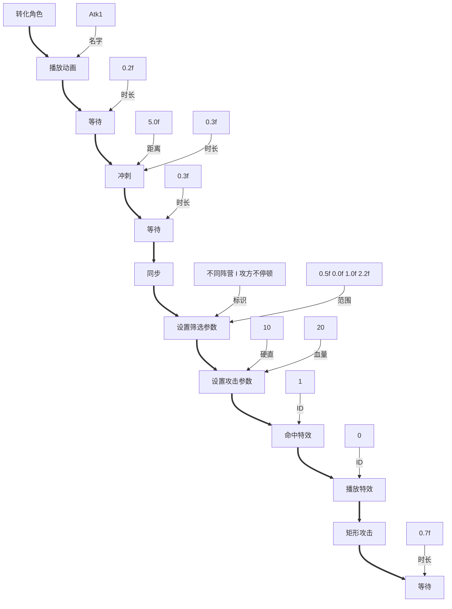
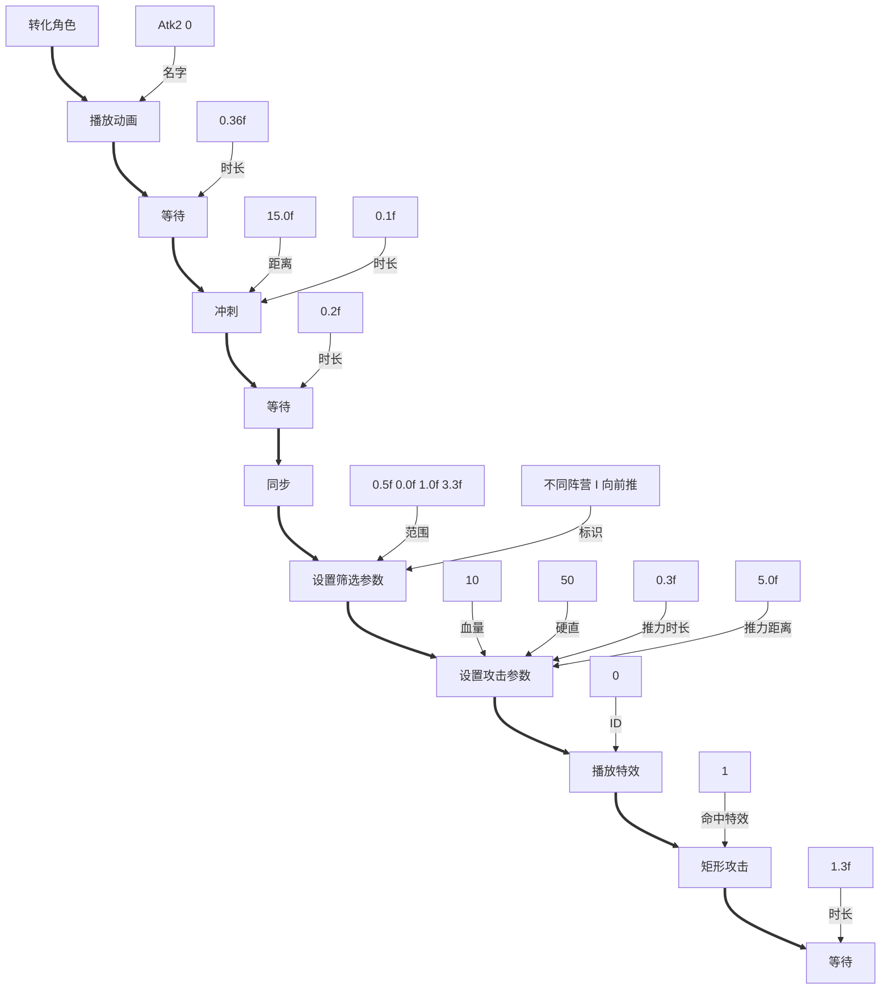
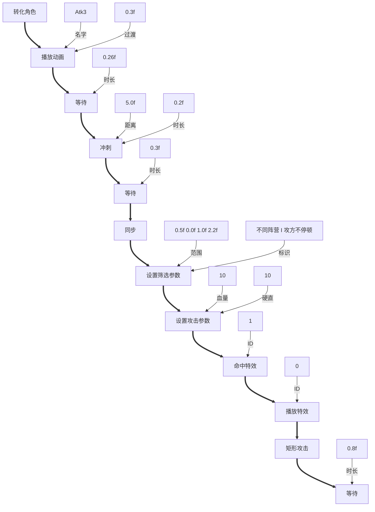
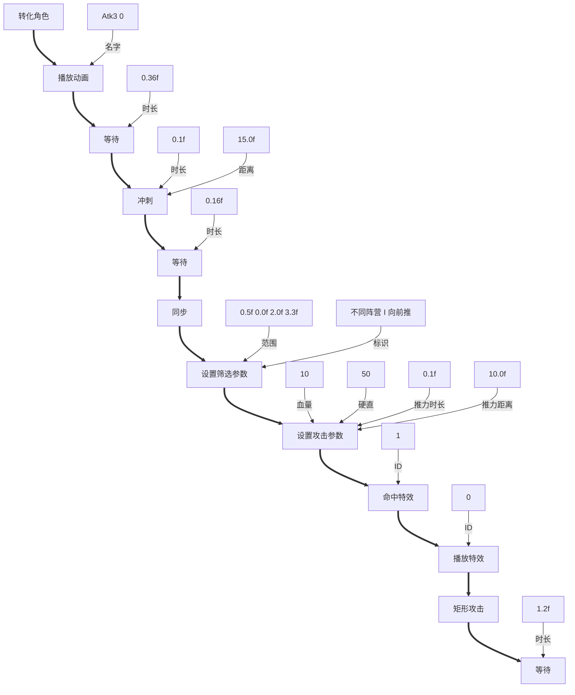
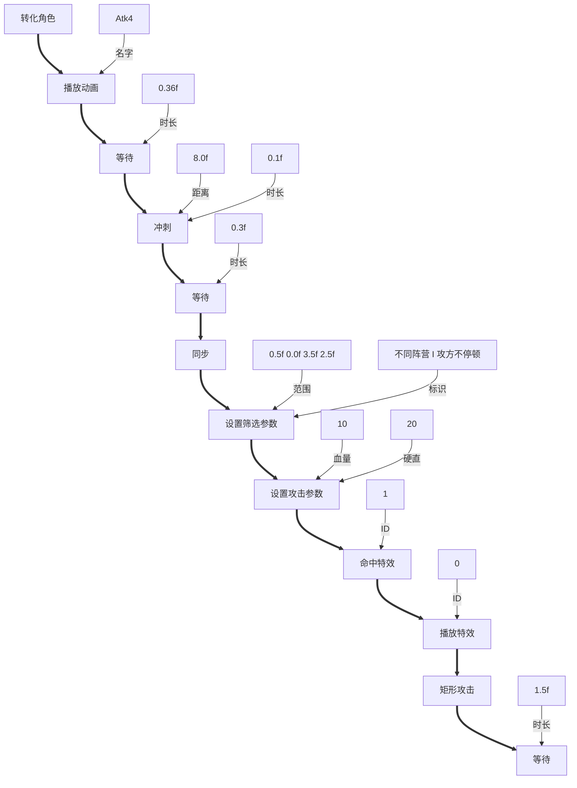
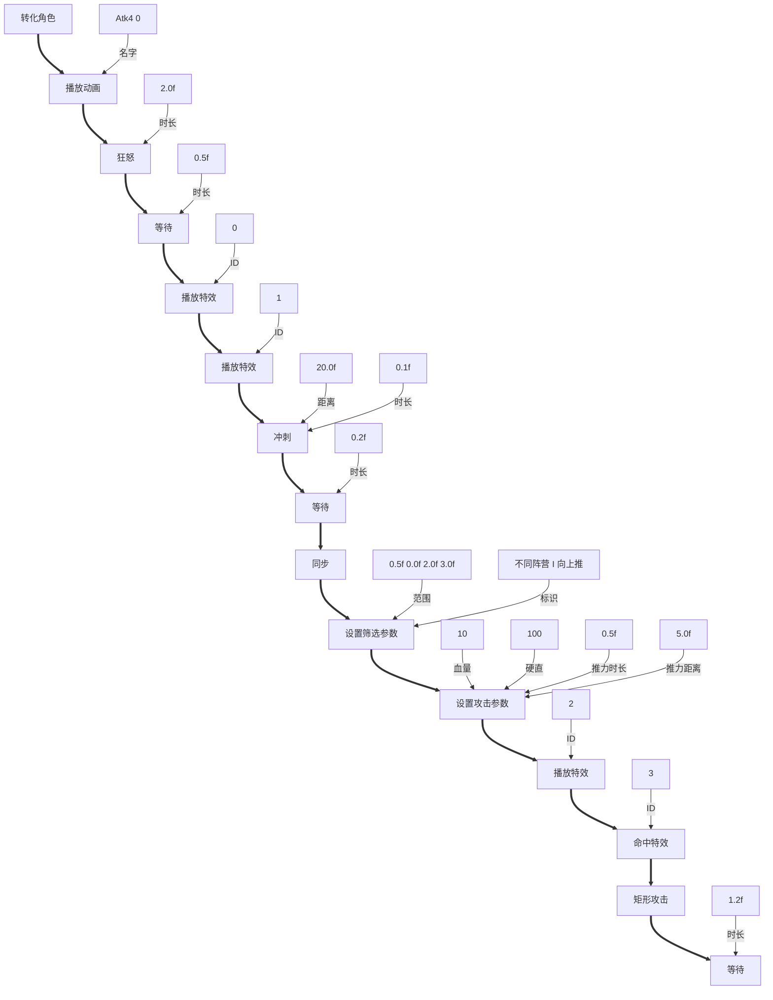
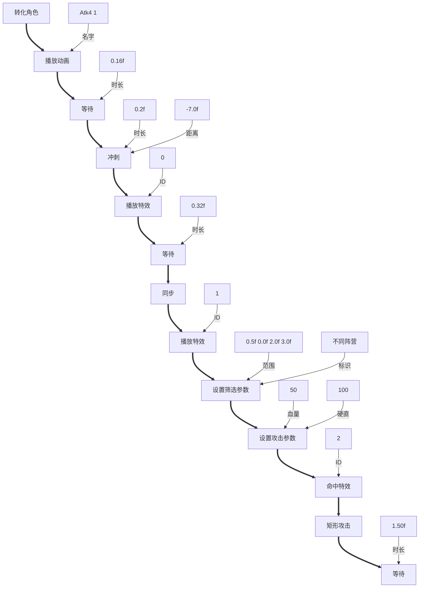
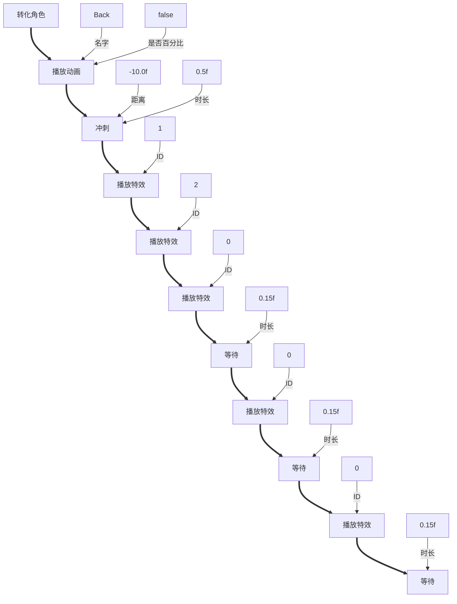
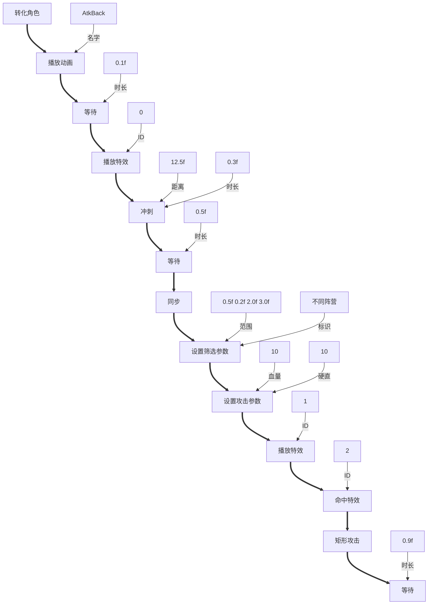
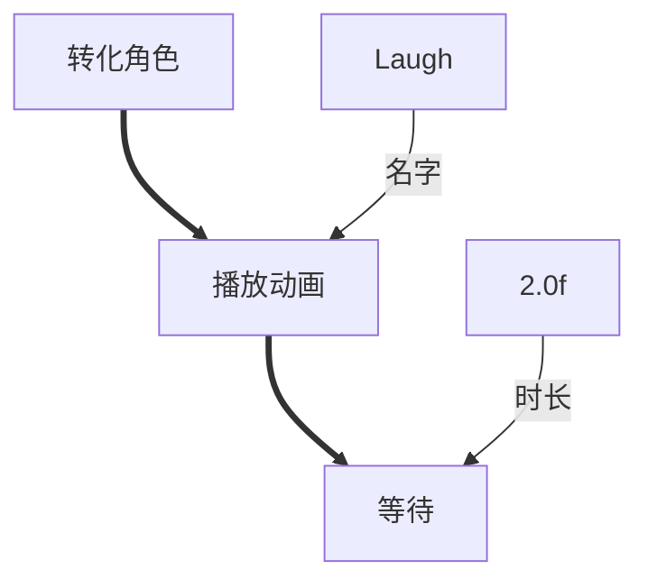

# 无脸男

---
* 方法: Atk1
* 描述: Atk1

---
* 方法: Atk2
* 描述: Atk2

---
* 方法: Atk2_0
* 描述: Atk2_0

---
* 方法: Atk3
* 描述: Atk3

---
* 方法: Atk3_0
* 描述: Atk3_0

---
* 方法: Atk4
* 描述: Atk4

---
* 方法: Atk4_0
* 描述: Atk4_0

---
* 方法: Atk4_1
* 描述: Atk4_1

---
* 方法: Back
* 描述: Back

---
* 方法: AtkBack
* 描述: AtkBack

---
* 方法: 嘲讽
* 描述: 嘲讽

