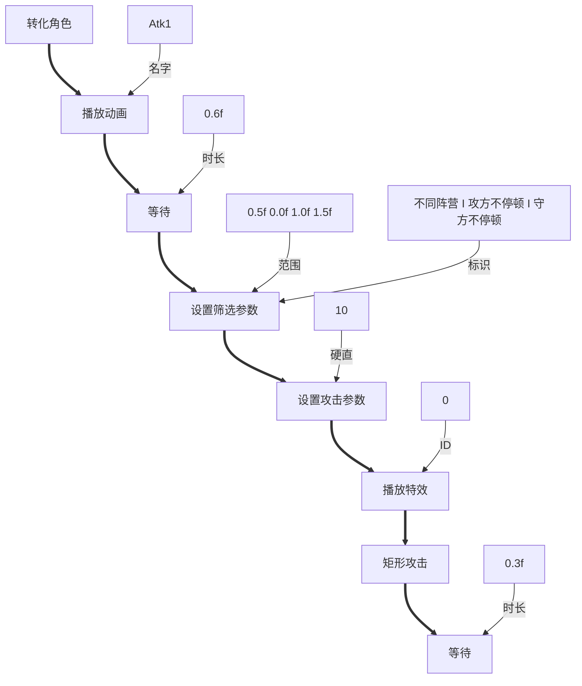

# 骷髅兵

---
* 方法: A1
* 描述: 刺拳

```mermaid
graph TD
转化角色 ==>
播放动画 ==>
等待0[等待] ==>
设置筛选参数 ==>
设置攻击参数 ==>
播放特效 ==>
矩形攻击 ==>
等待1[等待]

播放动画_名字[Atk1] --名字--> 播放动画
播放特效_ID[0] --ID--> 播放特效
设置筛选参数_范围[0.5f 0.0f 1.0f 1.5f] --范围--> 设置筛选参数
设置筛选参数_标识[不同阵营 I 攻方不停顿 I 守方不停顿] --标识--> 设置筛选参数
设置攻击参数_硬直[10] --硬直--> 设置攻击参数
等待0_时长[0.6f] --时长--> 等待0
等待1_时长[0.3f] --时长--> 等待1
```
